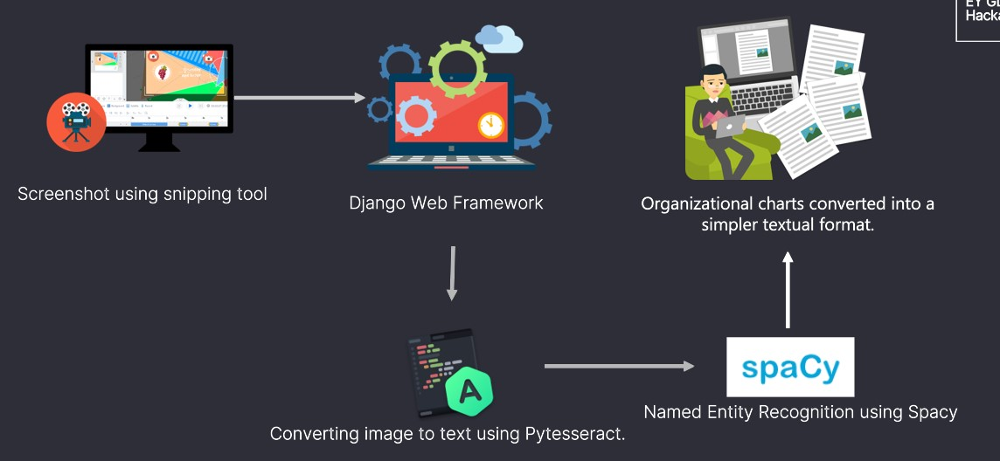

# Hackpions-EY-GDS-Hackathon
### Overview:
An organizational chart is a diagram that shows the structure of an organization and the relationships and relative ranks of its parts and positions, jobs, etc. Leverage the power of Machine Learning/Artificial Intelligence like Optical Character Recognition (OCR) in image recognition technology to convert organizational charts into a simpler textual format.
## Image to text conversion

Propose and design a solution to scan organizational charts in different formats (PDF, MS Word and Excel, image, etc.) consisting of flowcharts and shapes like an arrow showing parent-to-child entity relationship. Extract details like child and parent entity, ownership percentage, country, etc. from a flow-chart/diagram. Convert the content into an Excel format

## System Design

<ul>
  <li><b>Named Entity Recognition from charts:</b> spaCy an extremely fast statistical entity recognition system, that assigns labels to contiguous spans of tokens. The default model identifies a variety of named and numeric entities, including companies, locations, organizations and products. We can add arbitrary classes to the entity recognition system, and update the model with new examples.</li>
  <li><b>Tesseract:</b> Tesseract organizes text lines into blobs, and these lines and regions are analyzed for fixed pitch or proportional text. Text lines are broken into words differently according to the kind of character spacing. Recognition then proceeds as a two-pass process. In the first pass, an attempt is made to recognize each word in turn. Each word that is satisfactory is passed to an adaptive classifier as training data. The adaptive classifier then gets a chance to more accurately recognize text lower down the page.</li>
  </ul>
